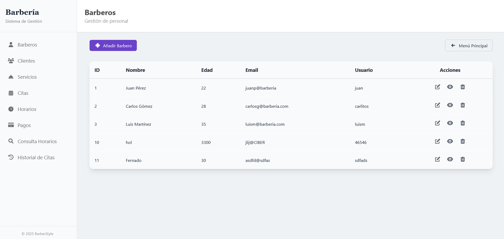
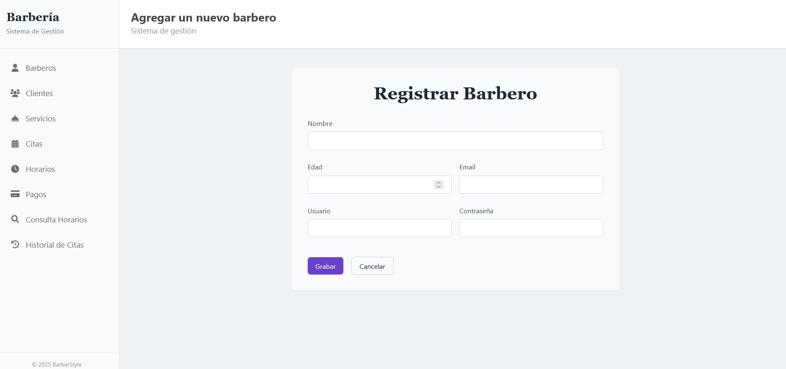
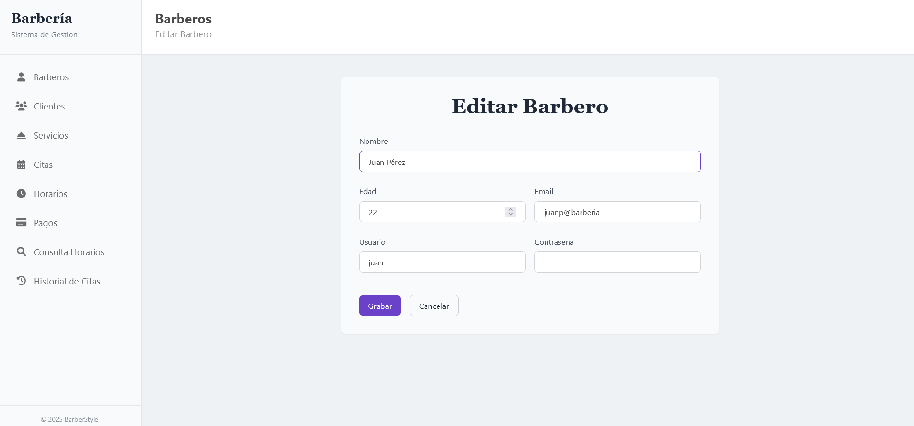
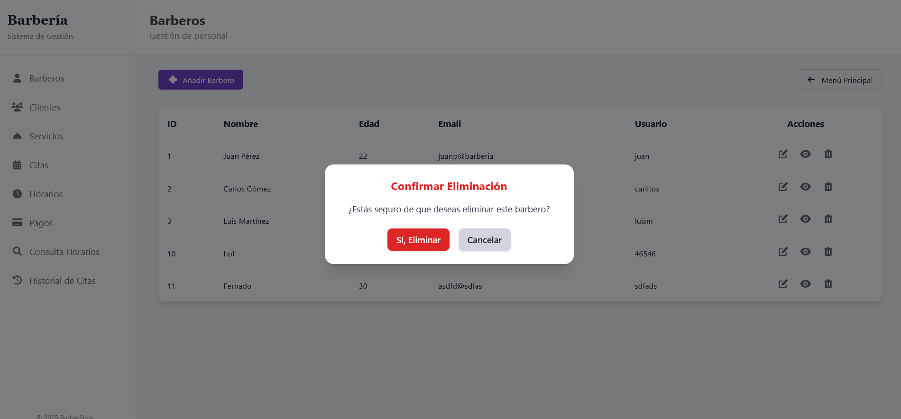
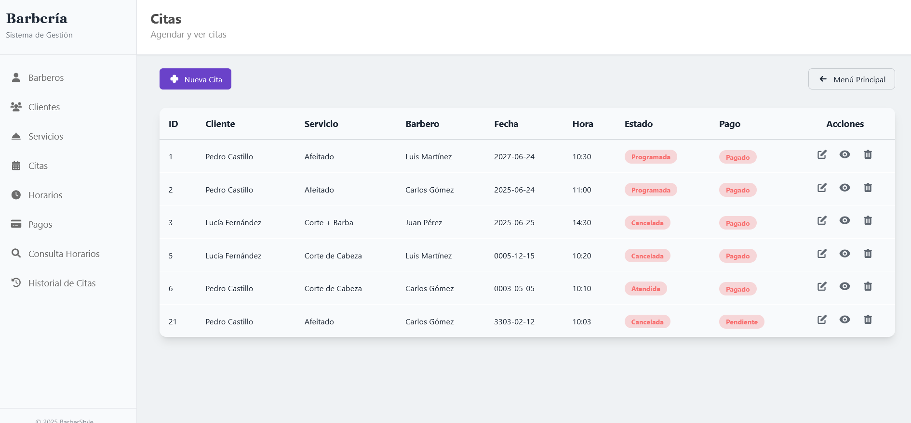
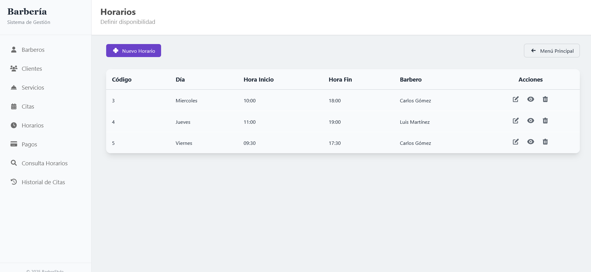
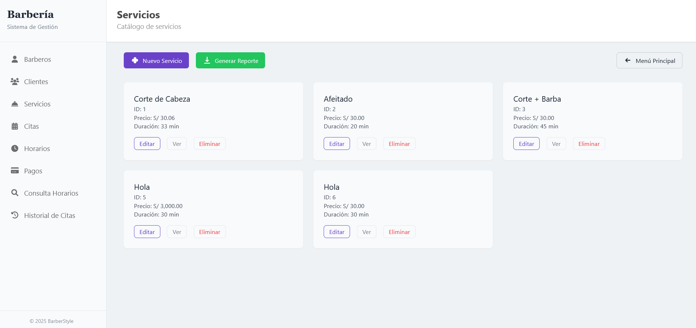
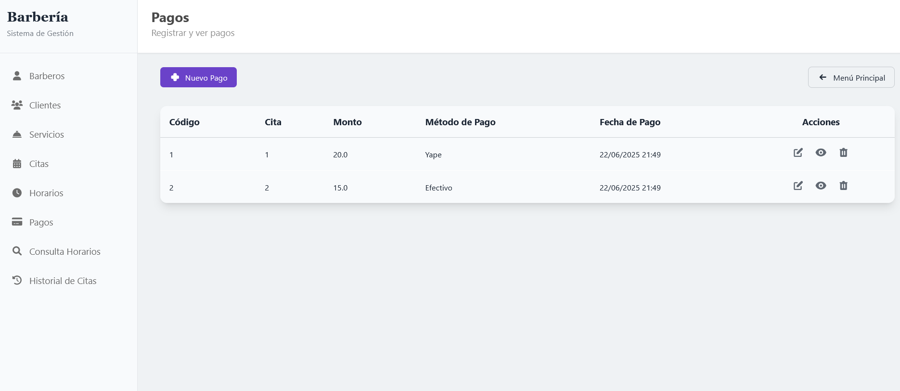
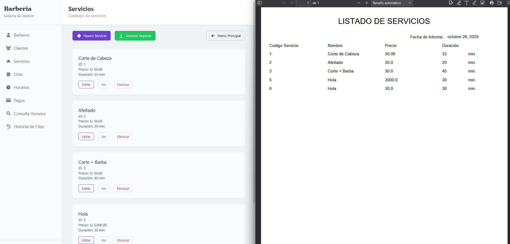

# Barber Style

**Barber Style** es una plataforma de gestión diseñada para mejorar la productividad de empresas y profesionales dueños de barberías en su día a día.

El sistema tiene como enfoque principal la gestión de citas, donde los colaboradores tienen control total para:

- Agregar, eliminar, editar y visualizar barberos

  **Ventana principal de: Barbero**  
  

  **Ventana de: Registrar - Barbero**  
  

  **Ventana de: Editar - Barbero**  
  

  **Ventana de: Eliminar - Barbero**  
  

- Gestionar citas de manera eficiente  
  

- Administrar horarios de disponibilidad  
  

- Gestionar servicios ofrecidos  
  

  - Administrar Pagos  
    

- Generar reportes y análisis  
  

## Tecnologías utilizadas

- **Backend**: Java con Spring Boot
- **Frontend**: Thymeleaf como motor de plantillas
- **Estilos**: Tailwind CSS
- **Base de Datos**: MySQL
- **Arquitectura**: MVC (Modelo-Vista-Controlador)

## Instalación y Configuración

1.  Clonar el repositorio

```bash
  git clone https://github.com/fernandoOS03/Proyecto_Barberia.git
```

2.  Configurar base de datos MySQL

```bash
  CREATE DATABASE barber_style;
```

3.  Configurar application.properties

```bash
  spring.datasource.url=jdbc:mysql://localhost:3306/barber_style
  spring.datasource.username=tu_usuario
  spring.datasource.password=tu_contraseña
```

4.  Ejecutar la aplicación

```bash
  ./mvnw spring-boot:run
```

## Screenshots


